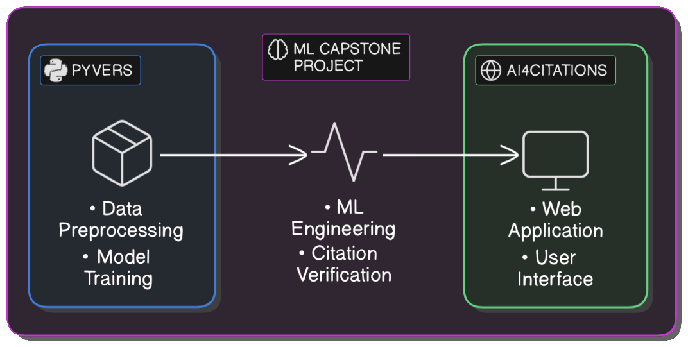

# ML Capstone Project

This project develops an NLP framework for automated validation of citations and claims, ensuring references accurately support stated information.
We build on established datasets and models to classify citation accuracy as SUPPORT, REFUTE, or NEI (Not Enough Information).

## Highlights

- Reproduction of state-of-the-art scientific claim verification baselines - [baselines](baselines)
  - Uses MultiVerS model, based on Longformer
- Development of Python package with ML engineering capabilities - [pyvers](https://github.com/jedick/pyvers)
  - Ingestion of multiple data sources using consistent labeling -- both data files and HuggingFace datasets
  - Uses HF models pretrained on natural language inference (NLI) datasets to support the claim verification task
  - Fine-tunes models using PyTorch Lightning for scalable model training, evaluation, and reporting
- Deployment of final model to HuggingFace - [fine-tuned model](https://huggingface.co/jedick/DeBERTa-v3-base-mnli-fever-anli-scifact-citint)
- Web app for end users - [AI4citations](https://github.com/jedick/AI4citations)
  - Input a claim and evidence statements to get results
  - Barchart visualization of class probabilities
  - Choose from pretrained and fine-tuned models

The model created in this project achieves <i>7 percentage point increase in average F1</i> over the best baseline model fine-tuned on a single dataset:

<table>
  <tr>
    <td></td>
    <td colspan="3">Macro F1 on test split</td>
  </tr>
  <tr>
    <td>Model</td>
    <td>SciFact</td>
    <td>Citation-Integrity</td>
    <td><i>Average</i></td>
  </tr>
  <tr>
    <td>SciFact baseline [1]</td>
    <td>0.81</td>
    <td>0.15</td>
    <td><i>0.48</i></td>
  </tr>
  <tr>
    <td>Citation-Integrity baseline [1]</td>
    <td>0.74</td>
    <td>0.44</td>
    <td><i>0.59</i></td>
  </tr>
  <tr>
    <td>Fine-tuned DeBERTa [2]</td>
    <td><strong>0.84</strong></td>
    <td><strong>0.47</strong></td>
    <td><strong><i>0.66</i></strong></td>
  </tr>
</table>

- [1] Fine-tuned MultiVerS on one dataset by the original authors ([Wadden et al., 2021](https://doi.org/10.48550/arXiv.2112.01640); [Sarol et al., 2024](https://doi.org/10.1093/bioinformatics/btae420))
- [2] Fine-tuned DeBERTa on shuffled data from both datasets in this project

## Milestones

All the steps of the project, from data exploration and processing to model training and deployment are recorded in notebook and blog posts.

- [Project Proposal](notebooks/00_Project-Proposal.md)
- **Data Wrangling**
  - [Citation-Integrity](notebooks/02_Data-Wrangling-for-Citation-Integrity.ipynb): Data quality (some claims are very short sentence fragments) and class imbalance (less than 10% of claims are NEI)
  - [SciFact](notebooks/03_Data-Wrangling-for-SciFact.ipynb): Partial test dataset (corrected with data from `scifact_10`; see below) and class imbalance (40% NEI and Support, 20% Refute)
- **Data Exploration**
  - [Citation-Integrity](notebooks/04_Data-Exploration-for-Citation-Integrity.ipynb): Main topics are cells, cancer, COVID-19, patients, infection, and disease
  - [SciFact](notebooks/05_Data-Exploration-for-SciFact.ipynb): Main topics are gene expression, cancer, treatment, and infection
- **Baselines**: MultiVerS model fine-tuned on single datasets
  - [Reproduction of Citation-Integrity](notebooks/01_Reproduction-of-Citation-Integrity.ipynb)
  - [Model baselines](notebooks/06_Baselines.ipynb)
  - [Comparison of starting checkpoints](notebooks/07_Checkpoints_and_Rationale_Weight.ipynb)
  - [eval.py](notebooks/eval.py): Metrics calculation module
- **Model Development**: DeBERTa fine-tuned on multiple datasets
  - [Experiments with different transformer models](https://jedick.github.io/blog/experimenting-with-transformer-models-for-citation-verification/) (blog post)
  - [Scaling up the model](notebooks/08_Scaling_Up.ipynb)

## Data Sources

The project utilizes two primary datasets, normalized with consistent labeling:

### SciFact
- 1,409 scientific claims verified against 5,183 abstracts
- Source: [GitHub](https://github.com/allenai/scifact) | [Paper](https://doi.org/10.18653/v1/2020.emnlp-main.609)
- Downloaded from: https://scifact.s3-us-west-2.amazonaws.com/release/latest/data.tar.gz
- Test fold includes labels and abstract IDs from [`scifact_10`](https://github.com/dwadden/multivers/blob/main/script/get_data_train.sh)

### Citation-Integrity
- 3,063 citation instances from biomedical publications
- Source: [GitHub](https://github.com/ScienceNLP-Lab/Citation-Integrity/) | [Paper](https://doi.org/10.1093/bioinformatics/btae420)
- Downloaded from: https://github.com/ScienceNLP-Lab/Citation-Integrity/ (Google Drive link)

For more details on data format, see [MultiVerS data documentation](https://github.com/dwadden/multivers/blob/main/doc/data.md).

## Managing Uncertainty

The best approach wasn't always obvious at the beginning.

- The order of sentence pairs in the tokenizer is important
  - Model documentation and papers are not clear about ordering sentence pairs for natural language inference
  - Experimenting with pretrained DeBERTa suggests that it was trained with evidence before claim
  - Maintaining the same order for fine-tuning and inference gives improved performance
  - The pyvers package uses this order consistently, improving reliability of NLI classification
    - See zero-shot demonstration in the pyvers [README](https://github.com/jedick/pyvers)
- Overfitting deep networks isn't necessarily bad
  - Fine-tuning pretrained transformer models on small datasets begins overfitting after 1 or 2 epochs
  - Nevertheless, continued fine-tuning improves prediction accuracy on test data
  - The bias-variance tradeoff in classical ML should be rethought for models with large numbers of parameters
    - Empirical discovery in this project: [blog post]((https://jedick.github.io/blog/experimenting-with-transformer-models-for-citation-verification/#the-paradox-of-rising-loss-and-improving-accuracy))
    - "Benign overfitting" in the research literature: [blog post](https://jedick.github.io/blog/modern-understanding-of-overfitting-and-generalization-in-machine-learning/)

## Looking Forward

TODOs for future development.

- Handle class imbalance: MultiVerS implements reweighting in the loss function. Can we do the same with DeBERTa?
- Data augmentation: Use a library such as [TextAttack](https://github.com/QData/TextAttack), [TextAugment](https://github.com/dsfsi/textaugment), or [nlpaug](https://github.com/makcedward/nlpaug) to add examples with synonyms or back-translations. This may improve generalizability.
- Low-rank adaptation (LoRA): Can [speed up fine-tuning](10.48550/arXiv.2106.09685) and [mitigate overfitting](https://web.stanford.edu/class/cs224n/final-reports/256907158.pdf) compared to optimizing all parameters in the model.

## Acknowledgments

This project builds upon several significant contributions from the research community:

- Citation-Integrity dataset by [Sarol et al., 2024](https://doi.org/10.1093/bioinformatics/btae420)
- DeBERTa model by [He et al., 2021](https://doi.org/10.48550/arXiv.2006.03654)
- MultiVerS model by [Wadden et al., 2021](https://doi.org/10.48550/arXiv.2112.01640)
- SciFact dataset by [Wadden et al., 2020](https://arxiv.org/abs/2004.14974)
- Longformer model by [Beltagy et al., 2020](https://doi.org/10.48550/arXiv.2004.05150)

